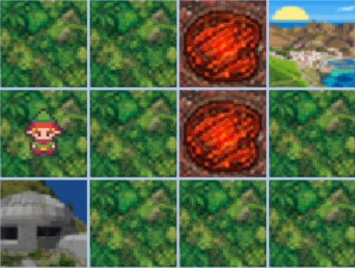

# Volcano Grid — RL Environment

A small grid-world reinforcement learning environment, built as a tribute to the **volcano crossing** example used in Stanford's [CS221: Artificial Intelligence: Principles and Techniques](https://stanford-cs221.github.io/).



## The problem

The agent starts on one tile and must reach a goal tile while avoiding lava (the volcanoes). Each step is one of four cardinal moves (N / E / S / W). Bumping into the grid boundary leaves the agent in place.

- **Goal tile** → large positive reward, episode ends
- **Lava tile** → large negative reward, episode ends
- **Step on grass** → small step penalty (encourages short paths)

The trade-off is between two end states: a safe but distant goal, and a tempting shortcut through the lava. Classic MDP territory — perfect for visualizing value iteration, Q-learning, or comparing model-based and model-free methods side by side.

## Installation

```bash
pip install gymnasium numpy pygame
```

## Quick start

```python
import gymnasium as gym
import volcano_env  # registers "VolcanoGrid-v0"

env = gym.make("VolcanoGrid-v0", render_mode="human")
obs, info = env.reset()

for _ in range(100):
    action = env.action_space.sample()
    obs, reward, terminated, truncated, info = env.step(action)
    if terminated or truncated:
        obs, info = env.reset()

env.close()
```

## Spaces

| | |
|---|---|
| **Observation** | `Discrete(rows * cols)` — flat grid index |
| **Action** | `Discrete(4)` — 0=N, 1=E, 2=S, 3=W |

## Why this environment

It's deliberately tiny (a handful of states, four actions), which makes it ideal for:

- Teaching value iteration and policy iteration — you can print the full value table
- Comparing tabular Q-learning vs SARSA and watching the cautious-vs-greedy split
- Visualizing how the discount factor γ changes whether the agent risks the shortcut
- Debugging a new algorithm before scaling up to anything harder

## Credits

Inspired by the volcano crossing example from Stanford CS221 lecture notes ([Winter 2021](https://stanford-cs221.github.io/winter2021-extra/modules/mdps/reinforcement-learning.pdf), [Autumn 2022](https://stanford-cs221.github.io/autumn2022-extra/modules/mdps/reinforcement-learning.pdf)).

## License

MIT
